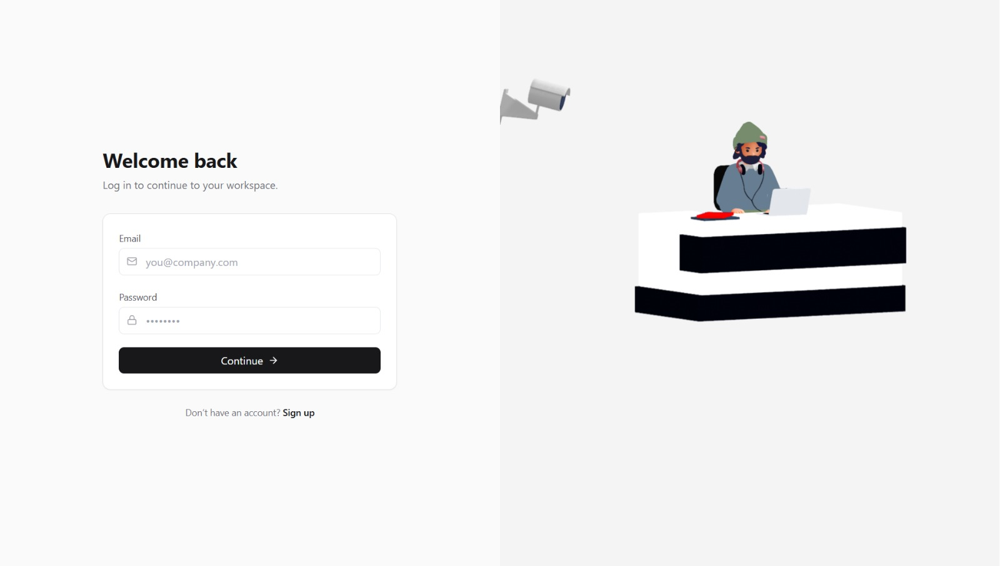
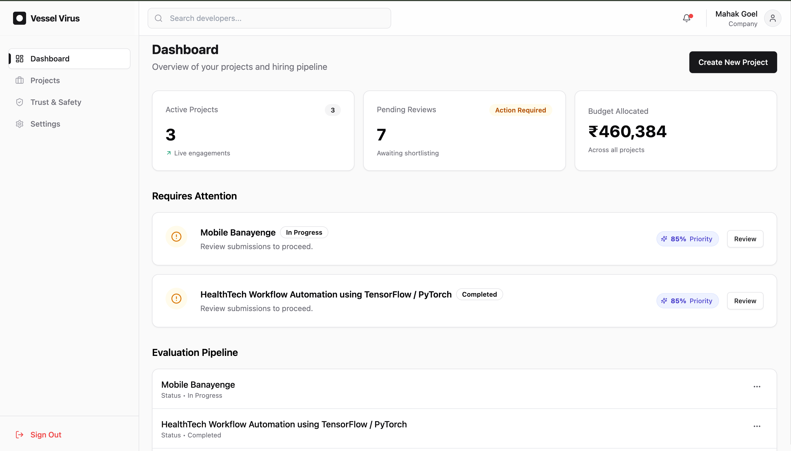
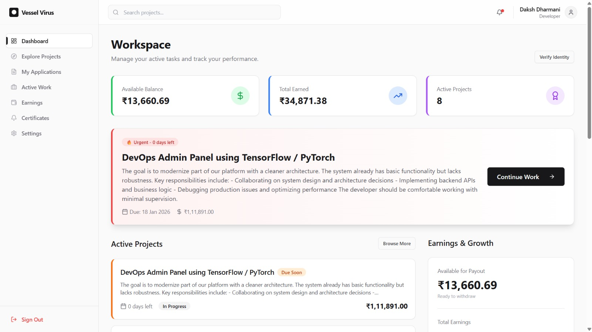
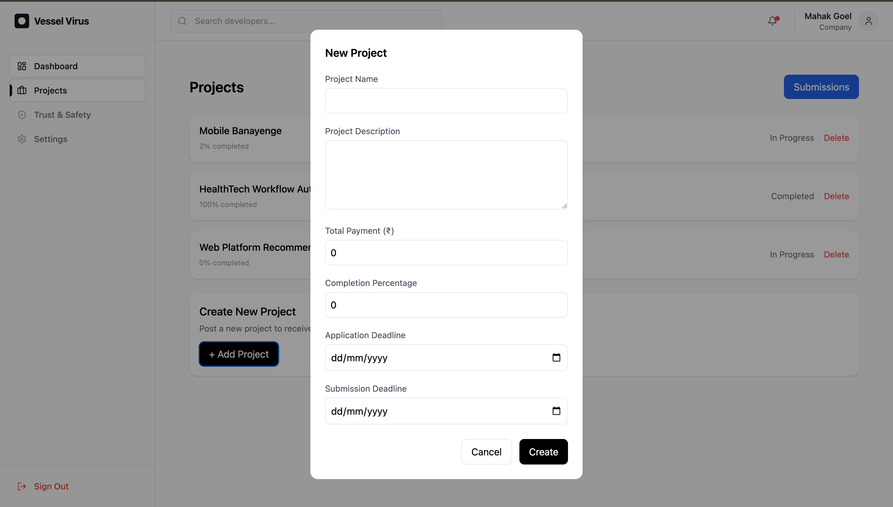
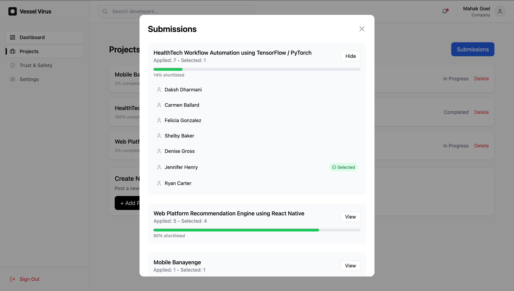
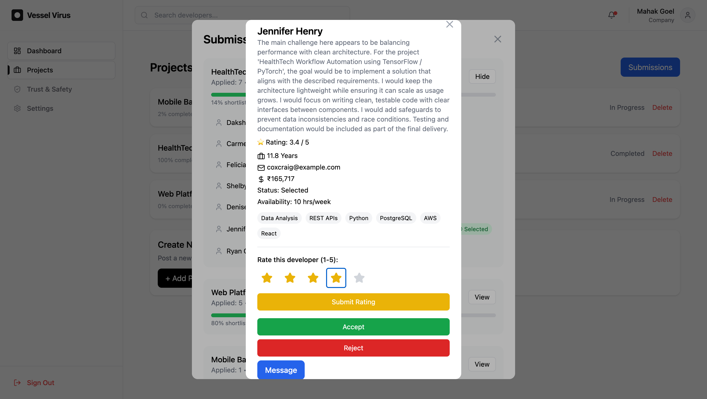
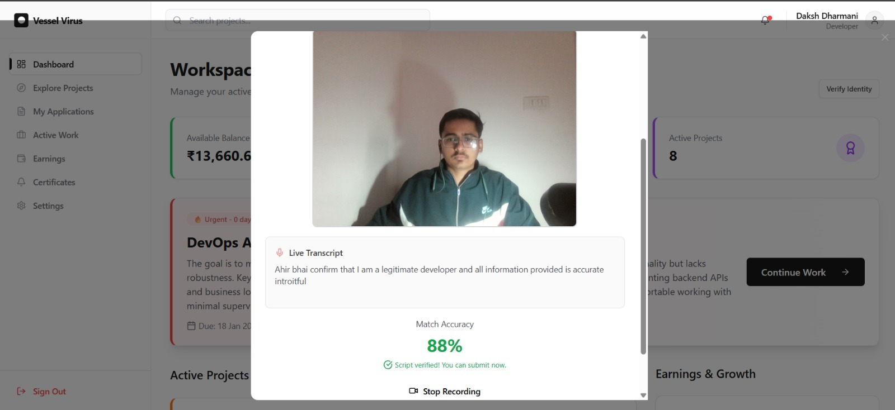
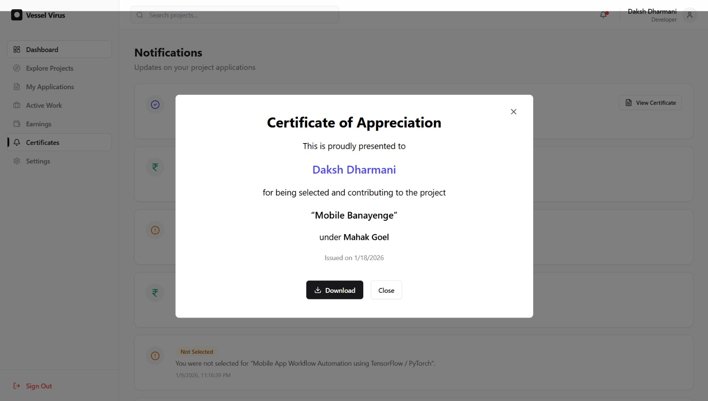
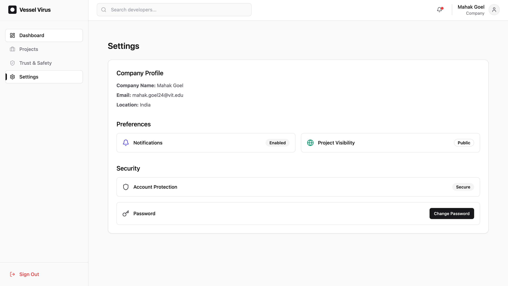

🧠⚛️ VESSEL VIRUS
Fair • Intelligent • Project-Based Hiring Platform
---------------------------------------------------------

Not a job board — an intelligence-driven hiring system.
---------------------------------------------------------

📌 Problem Statement

Traditional hiring platforms suffer from:

❌ Resume bias and keyword-based filtering

❌ Ghosting without accountability

❌ Unfair shortlisting driven by popularity, not merit

❌ No verifiable recognition for contributors
---------------------------------------------------------

Vessel Virus addresses these issues by introducing:

ML-driven fairness

Signal-based evaluation

Quantum-assisted optimization

➡️ Resulting in ethical, transparent, and merit-based hiring.

🎯 Purpose of the Platform

Vessel Virus connects companies with developers & designers for short-term, project-based collaboration, while ensuring:

✅ Fair shortlisting

✅ Transparent decision-making

✅ Verifiable contributor recognition

🌍 Aligned with SDG-8: Decent Work & Economic Growth
---------------------------------------------------------

🔄 How the Platform Works
🏢 For Companies

Register and post real-world projects

Define budget, deadlines, and expectations

Review structured, signal-based applications

Shortlist candidates using fair ranking

Communicate only at the appropriate stage
---------------------------------------------------------

👩‍💻 For Developers

Discover projects ranked by relevance + fairness

Submit structured proposals (no resumes)

Application lifecycle:

Applied → Interviewed → Shortlisted

Receive verifiable interview participation certificates
---------------------------------------------------------

🤖 Intelligent System Workflow

The platform automatically:

🔍 Shortlists candidates using ML models

🔓 Unlocks chat only after shortlisting

🏆 Generates interview participation certificates

⚛️ Selects final candidates using quantum-assisted optimization
---------------------------------------------------------

🌟 Core Features

🔐 Authentication & Roles

Single authentication system

Role-based experiences:

Company

Developer

📋 Project & Application Management

Real project postings with budgets & timelines

Structured, signal-based proposal submissions

Transparent application status tracking

🧠 Intelligence & Fairness

ML-powered project discovery

Fairness-aware shortlisting pipeline

Bias-free candidate evaluation

🏆 Recognition & Trust

Automatic interview certificates

Developer credibility tracking

Affidavit-based identity verification (video + audio)

💬 Communication & Updates

Real-time messaging (enabled post-shortlisting)

Backend-driven notifications

Payments tracking (expected vs actual)

🧠 ML-Powered Fair Matching Engine
(Core Intelligence Layer)

This is the brain of Vessel Virus.

🔬 Techniques Used

Semantic similarity via vector embeddings

Skill inference from proposal text

Fairness-aware ranking neural networks

Signal-based features:

Experience

Availability

Expected compensation

⚠️ Key Insight:
---------------------------------------------------------
Vessel Virus evaluates capability signals — not resumes.

⚛️ Quantum-Assisted Optimization Layer

Final shortlisting is treated as a multi-objective optimization problem.

🔍 Optimization Balances

Skill match score

Fairness constraints

Availability

Compensation limits
---------------------------------------------------------

⚙️ Technology Stack

QAOA-based quantum-inspired optimizer

QUBO formulation using Qiskit

Ensures globally fair outcomes, not greedy local rankings.

🖼️ Snapshots
---------------------------------------------------------
Screen	Description

| Screen | Preview |
|------|--------|
| Landing Page |  |

| Company Dashboard | Developer Dashboard |
|------|--------|
| |  |

| Project Posting | Applications Recieved | Candidate Tracking |
|------|--------|--------|
| |  | 

| Developer Verification | Certification |
|------|--------|
| |  |

| Screen | Preview |
|------|--------|
| Settings Page | |


👩‍💻 Developer Dashboard	Project discovery & application status

📤 Application Submission	Structured proposal submission

📑 Company Application Review	Fair shortlisting workflow

🏆 Certificates Page	Interview participation certificates

🔔 Notifications Panel	Status & system alerts

🌍 Deployment

🚀 Frontend (Vercel)
---------------------------------------------------------

🔗 [hm-062-vessel-virus.vercel.app]

🛠️ Backend API (Railway)
---------------------------------------------------------

🔗 [https://hm062vesselvirus-production.up.railway.app/docs]

🎥 Demo Video
---------------------------------------------------------

🔗 [https://drive.google.com/drive/folders/1uFDVgYocJEem_K3C88WyTREs35xS98Ca?usp=sharing]

🛠️ Tech Stack
---------------------------------------------------------
🎨 Frontend
---------------------------------------------------------

React

TypeScript

Vite

Tailwind CSS

🔧 Backend
---------------------------------------------------------

FastAPI

Supabase (Auth, Database, Realtime)

🧠 Machine Learning
---------------------------------------------------------

Sentence Transformers

Custom Skill Inference Model

Fair Ranking Neural Network

⚛️ Quantum / Optimization
---------------------------------------------------------

Qiskit

QAOA

QUBO formulation

☁️ Deployment
---------------------------------------------------------

Frontend: Vercel

Backend: Railway

```
📂 Project Structure
root/
│
├── fairwork-ai/
│   ├── backend/
│   │   ├── api/
│   │   ├── services/
│   │   └── database/
│   │
│   ├── ml/
│   │   ├── model_1_skill_inference/
│   │   ├── model_2_fair_ranking/
│   │   └── model_3_qml_optimizer/
│   │
│   └── requirements.txt
│
├── frontend/
│   ├── src/
│   ├── pages/
│   └── components/
│
└── README.md
```
---------------------------------------------------------

📖 Setup Instructions

🔁 Clone the Repository
git clone https://github.com/mahaksgoel-byte/Prototype-Based-Developer-Hiring-Platform

---------------------------------------------------------

⚙️ Backend Setup

cd fairwork-ai

python -m venv venv

source venv/bin/activate

pip install -r requirements.txt

uvicorn backend.api.main:app --reload

---------------------------------------------------------

🎨 Frontend Setup

cd frontend

npm install

npm run dev

---------------------------------------------------------

🚀 Upcoming Features

🔗 Smart contract-based payouts

📊 Advanced analytics for companies

🌐 Multi-language support

🧬 DAO-based reputation system

🔐 On-chain certificate verification

---------------------------------------------------------

📜 License

📄 MIT License
